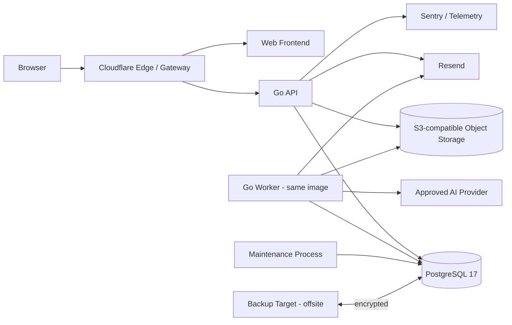

# Sistem Mimarisi

## Genel yön

HedefOra, tek ürün sınırı içinde modüler monolit olarak başlar. Dağıtım birimleri ayrılabilir fakat domain source-of-truth tek PostgreSQL üzerinde kalır.

Mermaid source repository içinde kanoniktir; harici diagram yalnız render/review yüzeyidir.

## Runtime bileşenleri

- `web`: public ve authenticated React/TypeScript uygulaması.
- `api`: HTTP API, auth, commands/queries, upload coordination.
- `worker`: River queue consumer; email, upload, AI, export, maintenance olmayan async işler.
- `maintenance`: kontrollü scheduler/cleanup/audit/backup coordination.
- `postgres`: transactional data ve River jobs.
- `object storage`: upload/export artifact'ları.
- `edge`: DNS/TLS/WAF/rate-limit/private-origin policy.

`api`, `worker` ve `maintenance` aynı Go codebase/image'dan farklı process mode ile çalışabilir.

## Frontend rendering

- Public marketing/legal sayfaları crawler ve erişilebilirlik için server/static render edilir.
- Authenticated uygulama React client interactions kullanır.
- API client OpenAPI'den generated olur.
- Design tokens ve accessible primitives tek kaynaklıdır.

## Self-hosted baseline

MVP başlangıcı tek Linux origin host üzerinde containerized olabilir; fakat:

- off-site backup zorunludur,
- DB volume uygulama container'ından ayrıdır,
- deploy immutable image digest ile yapılır,
- staging ve production kaynakları ayrıdır,
- tek host failure riski launch risk register'ında görünürdür.

## Olmaması gerekenler

- domain başına mikroservis,
- Redis cache/broker ekleyerek premature complexity,
- frontend'in doğrudan DB/object storage admin credential kullanması,
- public internetten origin app portları,
- runtime'da DB owner credential,
- agent tarafından doğrudan production secret okunması.
